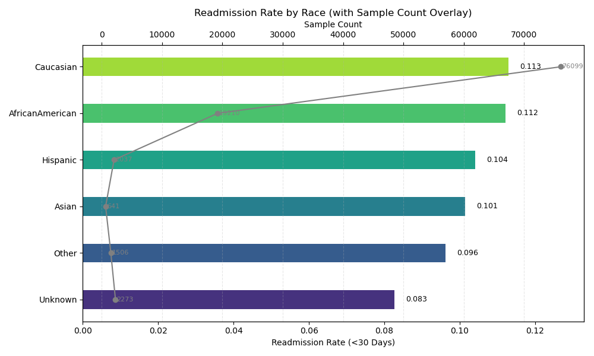
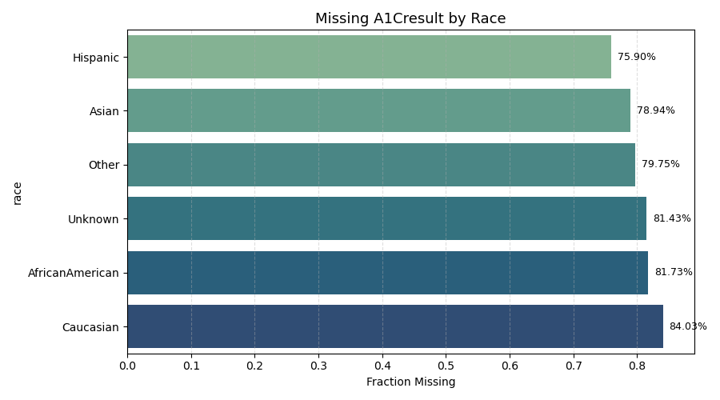

# openml-43903-diabetes-analysis

This repository investigates the Diabetes-130-Hospitals (Fairlearn) dataset (OpenML ID: 43903). The dataset contains over 101,000 hospital admission records for diabetic patients, spanning 130 U.S. hospitals over a 10-year period.

---

## Dataset Info
- **Records:** 101,766 hospital admissions  
- **Features:** 22  
- **Target variable:** `readmit_30_days` (1 = readmitted within 30 days)  
- **Sensitive Features Considered:**
  - `race`
  - `gender`
  - `age`
  - `medicare`
  - `medicaid`

---

## Disparities in Readmission Rates

| Feature     | Min Readmit Rate | Max Readmit Rate | Disparity Ratio (Min / Max) |
|-------------|------------------|------------------|--------------------------|
| `race`      | 8.27% (Unknown)  | 11.29% (Caucasian) | **0.7326**  |
| `gender`    | 0.00% (Unknown/Invalid) | 11.25% (Female) | **0.0000**  |
| `age`       | 10.15% (30–60 yrs) | 11.61% (Over 60) | **0.8745** |
| `medicare`  | 10.89% (False)   | 11.75% (True)    | **0.9269** |
| `medicaid`  | 11.14% (False)   | 11.78% (True)    | **0.9456** |

> A disparity ratio < 0.80 indicates potential unfairness and should be investigated further.

---

## Disproportionate Missing Values in Clinical Features

- **A1Cresult** missing in **83.3%** of all records
- **max_glu_serum** missing in **94.7%** of all records

#### A1Cresult Missingness by Race:

| Race            | Missing Rate |
|------------------|--------------|
| Hispanic         | 75.90%       |
| Asian            | 78.94%       |
| AfricanAmerican  | 81.73%       |
| Unknown          | 81.43%       |
| Other            | 79.75%       |
| Caucasian        | 84.03%       |

#### max_glu_serum Missingness by Gender:

| Gender           | Missing Rate |
|------------------|--------------|
| Female           | 94.70%       |
| Male             | 94.80%       |
| Unknown/Invalid  | 100.00%      |

These trends indicate that **some subgroups are systematically less observed**, especially in diagnostic features relevant to diabetes care.

---

### Small or Invalid Subgroups

- `gender = Unknown/Invalid`: only **3 samples**
- `race = Asian`: only **641 samples**
  
These are **not statistically significant** for model training and can cause:
- Instability in models
- Misleading fairness metrics
- Increased variance in subgroup evaluations

---

## Evidence of Bias

Two plots demonstrate bias clearly and are suitable for inclusion in public documentation or analysis reports:

  <table>
    <tr>
      <td> <b>Readmission Rate by Race</b></td>
      <td> <b>A1Cresult Missingness by Race</b></td>
    </tr>
  </table>

---
